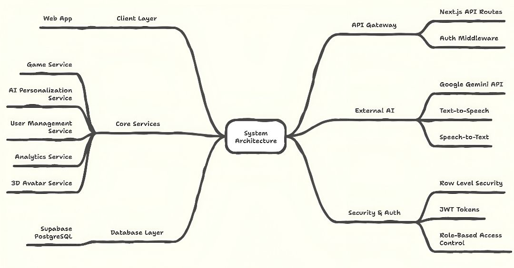

# BrainBerry - Personalized Therapeutic Learning Games

[](https://nextjs.org/)
[](https://www.typescriptlang.org/)
[](https://supabase.com/)
[](https://tailwindcss.com/)

## 📖 Overview

BrainBerry is a GenAI-assisted therapeutic mini-game platform that empowers educators to create safe, personalized cognitive and developmental training experiences for children. The platform uses immutable "Game Molds" (evidence-informed templates) that AI fills with child-relevant content while preserving pedagogical integrity.

### 🔗 SUBMISSION (Quick links)

- 👉 Product presentation PDF: [Presentation](./Thales.pdf)
- 👉 Live Demo deployment(no keys required): https://brainberry.vercel.app/
- 👉 Product showcase video: https://youtu.be/qF4HyBQRl6o 
- 👉 Local setup guide: [Local Development](./setup.md)


### 🎯 Target Audience
- **Neurodiverse children** (early childhood to pre-teen) needing engaging repetition & adaptive reinforcement
- **Educators/Therapists/Caregivers** supervising therapeutic or learning sessions
- **Product teams** exploring structured + AI hybrid content delivery for pediatric interventions

### ✨ Key Features
- 🧩 **Immutable Game Molds** - Evidence-based templates (Matching Cards, Sorting Challenges, etc.)
- 🤖 **AI Personalization** - Child-specific themed content generation via Google Gemini
- 🎮 **Polymorphic Game Player** - Dynamic routing to appropriate mini-game implementations
- 👥 **Role-Based Access** - Educator/Child separation with Row Level Security
- ⚡ **Performance Optimized** - Image preloading, caching, and smart rendering
- 🛡️ **COPPA Compliant** - Built-in safety and privacy protections
- 📊 **Analytics Ready** - Longitudinal tracking and progress monitoring

### 🏗️ Tech Stack

| Category | Technology | Purpose |
|----------|------------|---------|
| **Framework** | Next.js 15 (App Router) | Full-stack React with Edge compatibility |
| **Language** | TypeScript 5 | Type-safe development |
| **Backend** | Supabase | PostgreSQL, Auth, RLS, Storage |
| **Authentication** | Supabase Auth | Email/password with middleware protection |
| **Database** | PostgreSQL | Relational data with advanced features |
| **AI/ML** | Google Gemini API | Content generation and personalization |
| **Avatar/3D** | Ready Player Me | 3D avatar creation and customization |
| **UI/Styling** | Tailwind CSS, Radix UI | Modern, accessible component system |
| **Validation** | Zod | Runtime type validation |
| **Charts** | Recharts | Data visualization |
| **Package Manager** | pnpm | Fast, efficient dependency management |

### 🔄 Architecture and Flow



```
Educator → Game Mold → Child Interest Input → AI Content Generation → Personalized Game → Play Session → Analytics
```

## 🛠️ Prerequisites

Before setting up BrainBerry, ensure you have:

| Requirement | Version | Installation | Purpose |
|------------|---------|--------------|---------|
| **Node.js** | 18+ (20 LTS recommended) | [Download](https://nodejs.org/) | JavaScript runtime |
| **pnpm** | Latest | `npm install -g pnpm` | Fast package manager |
| **Git** | Latest | [Download](https://git-scm.com/) | Version control |

| Tool | Purpose | Installation |
|------|---------|--------------|
| **Supabase CLI** | Local database management | `npm install -g supabase` |
| **VS Code** | Recommended editor | [Download](https://code.visualstudio.com/) |


## 📊 Data Sources & Open Source Components

### 🔗 External APIs & Services

| Service | Purpose | Cost | Documentation |
|---------|---------|------|---------------|
| **Supabase** | Backend-as-a-Service | Free tier available | [docs.supabase.com](https://docs.supabase.com) |
| **Google Gemini** | AI content generation | Free tier: 60 req/min | [ai.google.dev](https://ai.google.dev) |
| **Ready Player Me** | 3D avatar creation | Free tier available | [docs.readyplayer.me](https://docs.readyplayer.me) |

### 📚 Open Source Libraries

<details>
<summary><strong>Core Framework & Language</strong></summary>

- **Next.js 15** - React framework with App Router
- **React 19** - UI library
- **TypeScript 5** - Type-safe JavaScript

</details>

<details>
<summary><strong>UI & Styling</strong></summary>

- **Tailwind CSS** - Utility-first CSS framework
- **Radix UI** - Accessible component primitives
- **Lucide React** - Icon library
- **next-themes** - Theme switching
- **class-variance-authority** - Component variants

</details>

<details>
<summary><strong>Data & Validation</strong></summary>

- **Zod** - Runtime type validation
- **React Hook Form** - Form handling
- **@hookform/resolvers** - Form validation integration

</details>

<details>
<summary><strong>3D & Animation</strong></summary>

- **Three.js** - 3D graphics library
- **@react-three/fiber** - React renderer for Three.js
- **@react-three/drei** - Three.js helpers
- **face-api.js** - Face detection and recognition

</details>

<details>
<summary><strong>Audio & Media</strong></summary>

- **wavefile** - WAV file manipulation
- **wawa-lipsync** - Lip sync animation
- **ffmpeg-static** - Video/audio processing

</details>

<details>
<summary><strong>Development & Testing</strong></summary>

- **ESLint** - Code linting
- **Playwright** - End-to-end testing
- **Vitest** - Unit testing
- **Testing Library** - React component testing

</details>

## 🎮 Usage Guide

### 👥 User Roles

| Role | Access | Capabilities |
|------|--------|--------------|
| **Educator** | Full platform access | Create child profiles, manage games, view analytics, assign personalized content |
| **Child** | Simplified interface | Play assigned games, customize avatars, track progress |

### 🚀 Getting Started Workflow

1. **Setup Account**
   ```bash
   # Navigate to your local instance
   open http://localhost:3000
   ```
   - Sign up as an educator
   - Complete profile setup

2. **Create Child Profiles**
   - Add children to your classroom/therapy group
   - Set learning goals and preferences
   - Configure safety and privacy settings

3. **Explore Game Molds**
   - Browse evidence-based game templates
   - Preview: Matching Cards, Sorting Challenges, Pattern Recognition
   - Understand pedagogical objectives

4. **Generate Personalized Content**
   - Input child interests (dinosaurs, space, animals, etc.)
   - AI generates themed content using safe, validated prompts
   - Review and approve generated materials

5. **Launch Game Sessions**
   - Assign games to specific children
   - Monitor real-time progress
   - Collect performance analytics

### 🎯 Current Features

| Feature | Status | Description |
|---------|--------|-------------|
| ✅ **Game Molds** | Live | Matching Cards, Sorting Challenges, Drawing game |
| ✅ **AI Personalization** | Live | Gemini-powered content generation |
| ✅ **Avatar System** | Live | Ready Player Me integration |
| ✅ **Progress Tracking** | Live | Basic analytics and scoring |
| 🚧 **Advanced Analytics** | In Progress | Detailed learning insights |
| 📋 **Workflow Management** | Planned | Async content generation queue |

### 🔮 Planned Features

- **Additional Game Types**: Storytelling games, Advanced games
- **Advanced Personalization**: Learning style adaptation, difficulty adjustment
- **Collaborative Features**: Multiplayer games, peer learning
- **Accessibility**: Screen reader support, motor accessibility options
- **Integration**: LMS connectivity, progress reporting APIs

## 📄 License

**Internal/Restricted** - Please add explicit license before open sourcing.

## 🎉 Quick Start Commands Summary

```bash
# Essential setup
git clone https://github.com/basantiroomie/brainberry.git && cd brainberry
npm install -g pnpm && pnpm install
cp .env.local.example .env.local
# Edit .env.local with your API keys
pnpm dev

# Development commands
pnpm type-check    # Type checking
pnpm lint         # Code linting  
pnpm build        # Production build
pnpm analyze      # Bundle analysis

# Database commands
supabase start    # Local database
supabase studio   # Database UI
supabase db reset # Reset with seed data
```
**Happy building & personalizing!** 🍓

